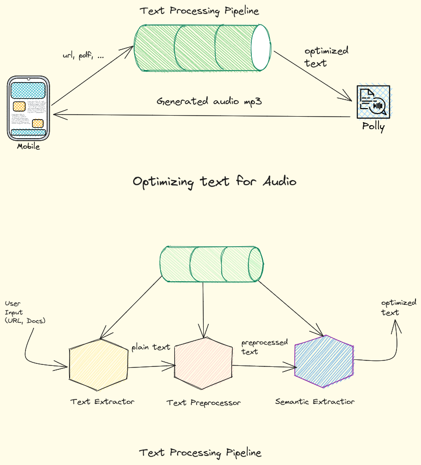

# InstaAudio

Clone:

```
$ git clone git@github.com:Enigmage/InstaAudio.git --recursive
```

## Architecture



- [Presentation Link](https://docs.google.com/presentation/d/1cz67PIiZ3ogAZHwz2q_aCcmu8KBcq5X0kujHvhHyJ6E/edit?usp=sharing)
